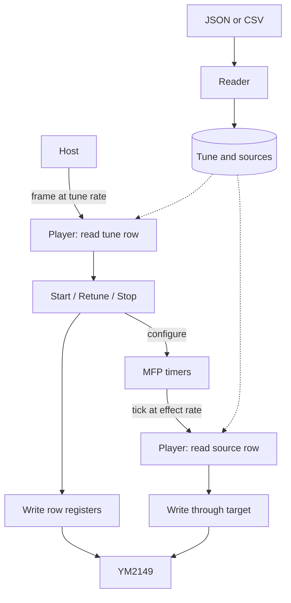

# YMXS - tune data for the Atari ST's sound chip, and the tools for it

## Read this first

**AI wrote most of YMXS.** Claude (Anthropic's Claude Code) wrote the
structure, the two trees of tools, the tests and most of what is written
here, under Robbert van Dalen's direction: he requested, read and merged
every change. [LICENSE](LICENSE) is the terms, and its attribution records
who did what. Whether to use software written that way is the reader's
decision, and this section is here so that the decision is informed.

The pieces it is built on are older than it. The YM3, YM5 and YM6
register-dump formats are Arnaud Carré's, and the depacker that opens a
distributed `.ym` is a port of the LZH code of his ST-Sound library.

## What YMXS is

YMXS defines a tune for the Atari ST as data: the settings a player
writes to the YM2149 sound chip each frame, and the effects that the
timers of the MC68901 (MFP) run at rates above the frame rate. It
defines what a player does with that data, and the range of every value
on the two chips.

This repository is the specification and five tools. The tools convert a
YM dump into a YMXS tune, check a tune, write it as JSON or CSV, and merge
several tunes into one file. A player is a separate program that reads a
YMXS tune and makes the sound, so a tracker that writes a YMXS tune
reaches every player that reads one.

## Getting started

The five tools come as standalone executables for Windows, macOS and
Linux, on x64 and arm64, from the
[releases](https://github.com/odipar/YMXS/releases): one zip a platform
([tools.md](doc/tools.md) 12).

| tool | reads | writes |
|---|---|---|
| `ym-to-ymxs` | a YM3, YM5 or YM6 dump | the tune as JSON |
| `ymxs-check` | a tune as JSON | the text read, and a report on standard error |
| `ymxs-json-to-csv` | JSON | CSV |
| `ymxs-csv-to-json` | CSV | JSON |
| `ymxs-merge` | several files of JSON, one after another | one file of JSON |

Each tool reads standard input and writes standard output, so one pipes
into the next. This converts a dump, checks it and writes it as CSV:

```bash
ym-to-ymxs < tune.ym | ymxs-check | ymxs-json-to-csv > tune.csv
```

[`packed.ym`](src/test/resources/packed.ym) is a dump to try it on, and
[`example.json`](doc/tunes/example.json) a tune to read. In a checkout the
same tools are under [`bin/`](bin), and [tools.md](doc/tools.md) 10 runs
the pipe a stage at a time.

## Words used here

| word | definition |
|---|---|
| YM2149 | the sound chip of the Atari ST |
| MFP | the MC68901, the chip of the four timers, A to D |
| register | one of R0 to R15 of the YM2149; a tune sets R0 to R13 |
| frame | one call of the player |
| tick | one interrupt of a timer |
| row | one entry of a table |
| tune | a title, a composer, a writer, a rate and a table of rows |
| multi | a list of tunes, numbered from 1; the host selects a tune by number |
| effect | the source connected to a target on a timer, at the rate of its prescaler and count |
| source | a name and a table of one, two or three values a row |
| target | a procedure the player calls at a tick with one row of a source |
| host | the program that selects a tune and calls the player once a frame |
| YM5 or YM6 dump | a file of sixteen bytes a frame, one a register of the YM2149 |
| YM3 dump | a file of fourteen bytes a frame, R0 to R13, the frames opening it |

## Reading and playback

A reader loads a file into the tune data structure. The host calls
the player at the tune's frame rate; the MFP timers raise ticks at
each effect's rate. Both procedures write YM registers.



A frame performs timer operations before register writes. A tick
advances its timer's source position, the *place*, or stops the timer
when the source ends. Each table repeats from its repeat row or plays
once. [SPEC.md](doc/SPEC.md) sections 4 and 5 define the procedures;
section 8.6 leaves the timing of ticks within a frame to a later version.

## Implementing a player or a reader

Start with [SPEC.md](doc/SPEC.md): data structure and chip values
(1 to 3), playback (4 and 5), writer rules (6), recorder output (7),
and later versions (8). Tests compare its Java declarations with
[`YMXS.java`](src/main/java/org/ymxs/YMXS.java).

[JSON](doc/json.md) encodes every tune. [CSV](doc/csv.md) encodes tunes
whose texts are free of line feeds and carriage returns. A player's
binary layout is defined by that player.

[`example.json`](doc/tunes/example.json) appears in both form documents
and as recorder output in SPEC.md 7. [tools.md](doc/tools.md) covers
conversion, checking and merging; [ym.md](doc/ym.md) defines YM import.
[doc/conformance](doc/conformance) is the kit an independent recorder is
written against, and the runs against it.

## What is here

| source | purpose |
|---|---|
| [`YMXS.java`](src/main/java/org/ymxs/YMXS.java) | the structure, listed in [SPEC.md](doc/SPEC.md) 1 |
| [`Chip`](src/main/java/org/ymxs/Chip.java) | the figures of the two chips |
| [`Tunes`](src/main/java/org/ymxs/Tunes.java) | the functions over a structure: its sources, its timers, its effects in order |
| [`Check`](src/main/java/org/ymxs/Check.java) | the errors of a structure, and the warnings of [SPEC.md](doc/SPEC.md) 6 |
| [`Json`](src/main/java/org/ymxs/Json.java) | JSON objects |
| [`Text`](src/main/java/org/ymxs/Text.java) | JSON text |
| [`Csv`](src/main/java/org/ymxs/Csv.java) | CSV, defined in [csv.md](doc/csv.md) |
| [`tool/`](src/main/java/org/ymxs/tool) [`bin/`](bin) | the five tools, defined in [tools.md](doc/tools.md) |
| [`ym/`](src/main/java/org/ymxs/ym) | a YM register dump read into the structure, defined in [ym.md](doc/ym.md) |
| [`doc/tunes/`](doc/tunes) | seven files of tunes as JSON, two as CSV as well; the tests read every one back |
| [`go/`](go) | the same five tools in Go, the executables of a release |

The records have accessors alone. Functions use exhaustive pattern
matching, so adding a shape requires updating those functions to compile.

## Building

Use Java 23 and Maven. `mvn test` checks the example tunes, specification
declarations, YM import and house style. With the Java tools built
([tools.md](doc/tools.md) 11.2), it also tests pipes; with Go on the
path, it compares the Go and Java tools byte for byte.

```bash
bin/ym-to-ymxs < tune.ym | bin/ymxs-check | bin/ymxs-json-to-csv > tune.csv
```

The Go module under [`go/`](go) provides the structure, both forms and
the same tools. [`release/publish.sh`](release/publish.sh) builds
standalone executables for Windows, macOS and Linux on x64 and arm64.

```bash
cd go && go test ./... && go build ./cmd/...
release/publish.sh
go get github.com/odipar/ymxs/go@v0.4.5
```

## Where the figures come from

Every limit of a value follows from the two chips and the 68000
([SPEC.md](doc/SPEC.md) 2 and 3). The choices of the structure follow
measurements of register dumps, read as [ym.md](doc/ym.md) defines; the
dumps are outside this repository.

## Related repositories

[YMXR](https://github.com/odipar/YMXR) is a player of YMXS tunes for the
Atari ST. [YMX](https://github.com/odipar/YMX) is the family this
repository belongs to: a design document defining how YMXS, YMXR, DTX and
ST4 fit together.

## License

The format may be implemented freely; [SPEC.md](doc/SPEC.md) is the
specification, and an independent reader, player or writer of it owes
only the acknowledgement of condition 2 of [LICENSE](LICENSE):
documentation that indicates YMXS was used. The structure, the tools and
the tests under `src/` and `go/` may be used freely within your programs,
for any platform, commercial releases included, on that same condition.
LICENSE is the whole of the terms, with the notices that cover the LHA
depacker.

## Attribution

YMXS, its specification, its tools and its tests are © 2026 Robbert van
Dalen. Claude (Anthropic's Claude Code) wrote the structure, the two
trees of tools, the tests and most of the documents, under Robbert van
Dalen's direction: he requested, read and merged every change.

The YM3, YM5 and YM6 register-dump formats are by Arnaud Carré
(Leonard/Oxygene); `ym-to-ymxs` reads them, and its LHA depacker is a
port of the LZH code of his ST-Sound library, itself based on LZH code by
Haruhiko Okumura (1991) and Kerwin F. Medina (1996).
